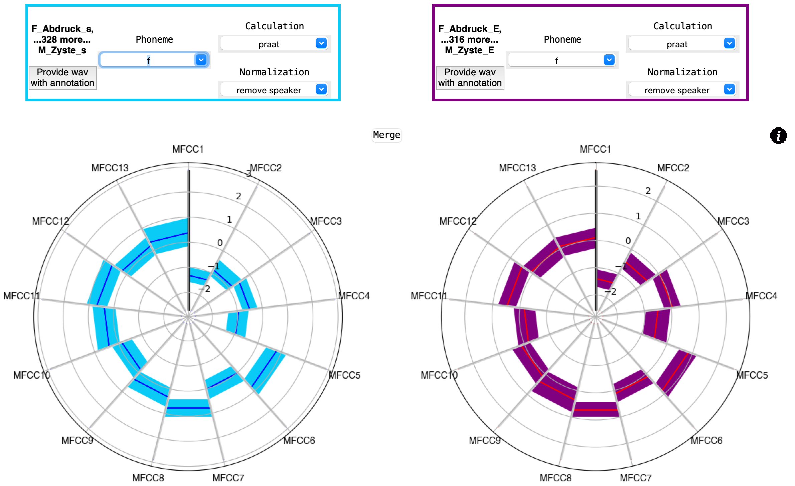

# MFCC-Plotter
This repository contains the project MFCC-Plotter.


## Overview
*MFCC-Plotter* is a graphical and interactive method to compare cepstal data, specifically MFCCs.
The MFCCs are displayed in 13 dimensions in a polar-box-plot like structure.

It allows the comparison of two plots next to each other. This enables a user to compare different phonemes, different normalization techniques or different MFCC calculation options of several recordings.
To provide one or several input recordings, you have to provide both audio files (only .wav-files are allowed so far) and annotation files (either .TextGrid or _annot.json).
The MFCC-Plotter runs locally on your own machine.


## Installation
The MFCC-Plotter is written in python with the framework Tkinter. So far, when you want to use the graphical tool, you have to execute the commands for this yourself.

When you downloaded or cloned the repository, you can start it via executing a command like this:
```
python3 src/controller.py
```
The controller is the main file which starts all other sub-programs.

### Version and packages
Notice that we developed the MFCC-Plotter using python 3.8.0. Therefore, we cannot guarantee that our code will work or look the same when using other python versions.
The needed packages are found in the `requirements.txt` file. We suggest, you create a virtual environment for this project and execute the MFCC-Plotter from there.

### Standalone MFCC-Plotter
We're currently working on packing the MFCC-Plotter in a production-ready package.
Any updates on this will be posted here.

### A note on operating systems
We developed the MFCC-Plotter for MacOS. It should work similarly on other Unix-like systems, but no guarantee on this. We are currently working on the MFCC-Plotter for Windows. Once it's done, we update the information here.

## Versions
| version | comment |
| - | - |
| v0.5.0 | intial version on this repo |
| v0.5.1 | code got cleaned |
| v0.6.0 | dropdown menus for selection options |
| v0.7.0 | added parsing option for _annot.json files |
| v0.8.0 | added actual research results in the resources/ dir |
| v0.8.1 | found and removed error with the information menu |
| v1.0.0 | First publishing, mainly intended for ESSV 2023 |

## Research results
The directory `resources/` contains one sub directory with some research results.

### Research on emotional speech
In the directory `resources/wasep_public_results/` are three PDF-files located. They compare, of two speakers of 318 recordings in total, compare either
- different phonemes for one emotion-contrast or
- the same phoneme in five emotion-contrasts.
These results are mainly an extension for a paper for the research conference ESSV 2023 (https://www.phonetik.uni-muenchen.de/ESSV2023/essv2023en.html).
Once the paper is published, it will be linked here as well.